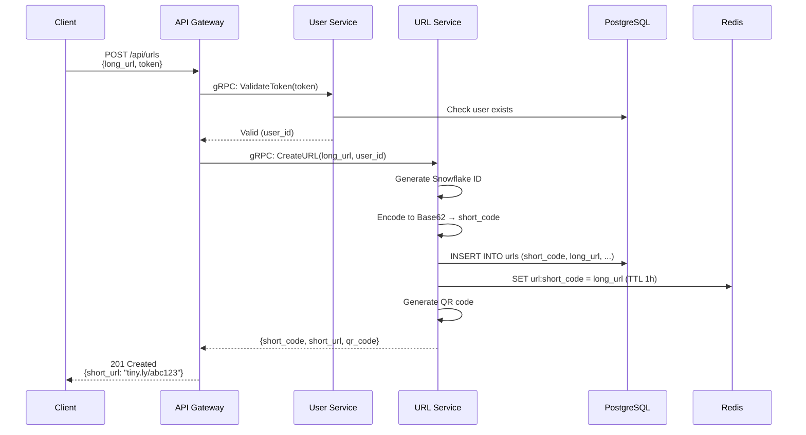
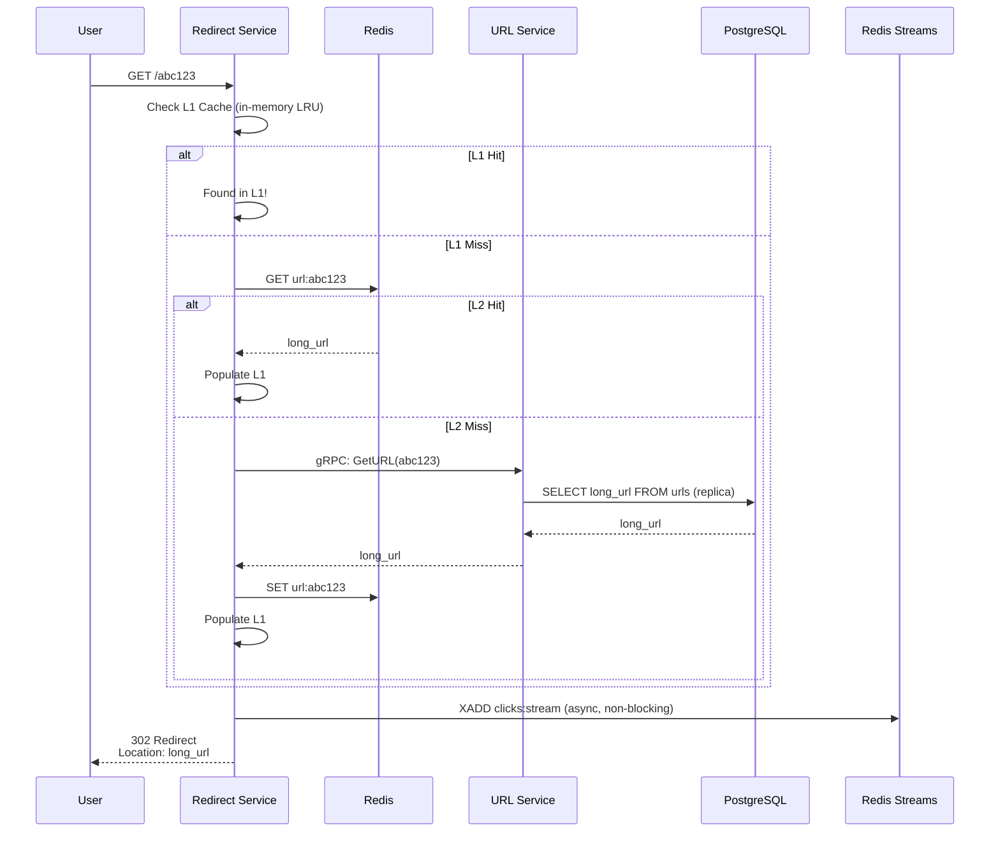
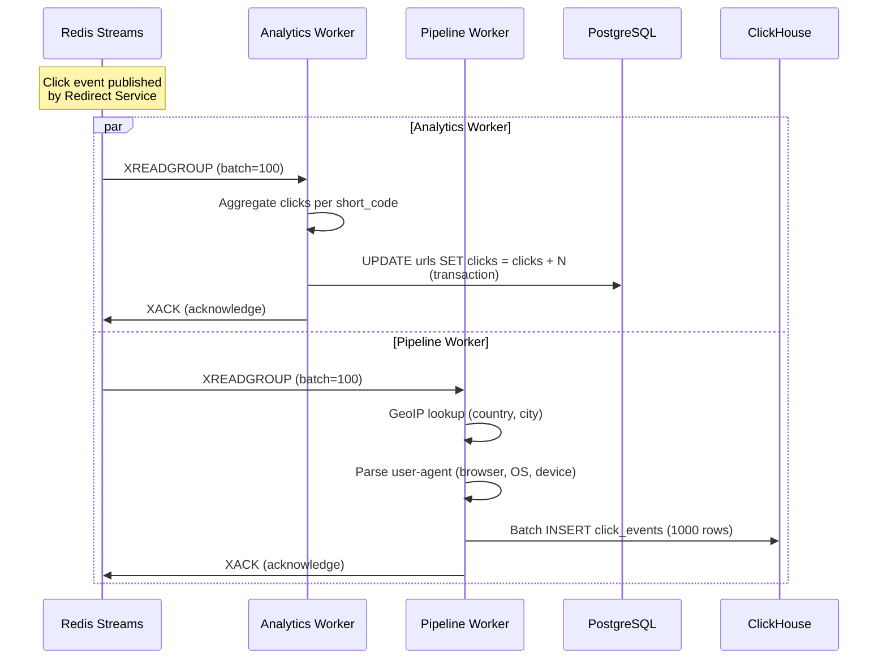

# The Big Picture: URL Shortener Architecture Explained

> **Understanding the entire system before diving into details**

## Overview

What does it actually take to build a production-ready URL shortener? At first glance, the problem seems simple: take a long URL, generate a short code, store the mapping, and redirect users. But as you dig deeper, questions emerge:

- How do you generate short codes that won't collide?
- What happens when you need to handle 10,000 redirects per second?
- How do you track analytics without slowing down redirects?
- Should you build everything in one application or split it into services?
- Which database(s) should you use and why?

This document answers these fundamental questions by exploring the **Tiny URL Shortener** architecture from 30,000 feet. We'll understand:
1. **The Problem** - What challenges does a URL shortener face?
2. **The Naive Solution** - The simplest approach and why it breaks
3. **Our Architecture** - The microservices system we built
4. **Design Philosophy** - Why we made these specific choices

By the end, you'll have a mental model of how all the pieces fit together. Then, in subsequent documents, we'll dive deep into each component with line-by-line code analysis.

---

## Part 1: The Problem Statement

### What Does a URL Shortener Do?

A URL shortener takes long URLs and creates short, memorable links:

```
Input:  https://example.com/products/summer-sale-2024?utm_source=email&utm_campaign=newsletter
Output: https://tiny.ly/abc123
```

When someone visits `tiny.ly/abc123`, they're instantly redirected to the original URL.

### Core Requirements

1. **Create Short URLs**
   - Accept any valid HTTP/HTTPS URL
   - Generate a unique short code (6-8 characters)
   - Store the mapping permanently
   - Optionally: Support custom aliases (e.g., `tiny.ly/product-launch`)

2. **Redirect Users**
   - Look up short code → original URL
   - Redirect in under 50 milliseconds
   - Handle 10,000+ requests per second
   - Work reliably (99.9% uptime)

3. **Track Analytics**
   - Count total clicks per URL
   - Capture geographic data (country, city)
   - Track device types (mobile, desktop, tablet)
   - Identify browsers and operating systems
   - Record referrers and timestamps

4. **Support Users**
   - User accounts and authentication
   - List all URLs created by a user
   - Allow URL deletion
   - Set expiration dates
   - Generate QR codes

### Hidden Challenges

The **hard parts** aren't obvious at first:

**Challenge 1: Uniqueness**
How do you generate millions of short codes without collisions? A naive random generator will eventually create duplicates. You need a strategy that guarantees uniqueness across multiple servers.

**Challenge 2: Performance**
Every redirect requires a database lookup. If you're doing 10,000 redirects/second, that's 10,000 database queries/second. Databases can't sustain this without caching.

**Challenge 3: Analytics Without Slowdown**
You want to track every click with rich data (GeoIP, user-agent parsing). But these operations take 10-50ms each. You can't make users wait while you process analytics - redirects must be instant.

**Challenge 4: Scaling**
What happens when one server isn't enough? Can you add more servers? How do they coordinate? Where are the bottlenecks?

**Challenge 5: Data Stores**
Do you use one database or multiple? SQL or NoSQL? How do you query millions of click events efficiently?

---

## Part 2: The Naive Solution

Let's start with the **simplest possible implementation** and see where it breaks.

### Single-Server Monolith

```
┌─────────────────────────────────────┐
│         Go HTTP Server              │
│                                     │
│  POST /api/urls  → Create Short URL │
│  GET /{code}     → Redirect         │
│  GET /api/stats  → Analytics        │
│                                     │
└──────────────┬──────────────────────┘
               │
        ┌──────▼──────┐
        │  PostgreSQL │
        │             │
        │ urls table  │
        │ clicks table│
        └─────────────┘
```

**How it works:**
1. One Go web server handles all requests
2. One PostgreSQL database stores everything
3. To create a URL:
   - Generate random 6-character string
   - Check if it exists in DB (retry if collision)
   - Insert into `urls` table
4. To redirect:
   - Query DB: `SELECT long_url FROM urls WHERE short_code = $1`
   - HTTP 302 redirect
   - Insert click event into `clicks` table
5. To show analytics:
   - Query DB: `SELECT COUNT(*), country, device FROM clicks WHERE short_code = $1 GROUP BY country, device`

### Why This Breaks

**Problem 1: Database Bottleneck**
Every redirect = 2 database queries (1 SELECT + 1 INSERT). At 10,000 req/sec, that's 20,000 queries/sec. PostgreSQL on a single server maxes out around 5,000-10,000 queries/sec. **You're overloaded.**

**Problem 2: Slow Redirects**
Each redirect waits for TWO database operations:
- SELECT for URL lookup: ~5ms
- INSERT for click tracking: ~5ms
- **Total: ~10ms per redirect**

But 10ms is too slow. Users expect instant redirects. And if the database is under heavy load, queries can take 50-100ms or more.

**Problem 3: Analytics Kills Performance**
When someone views analytics, you run complex aggregation queries:
```sql
SELECT country, COUNT(*) FROM clicks WHERE short_code = 'abc123' GROUP BY country
```

These queries scan thousands or millions of rows. On PostgreSQL, this can take **seconds**, locking tables and slowing down redirects.

**Problem 4: Single Point of Failure**
If the server crashes, everything stops. No redundancy, no failover.

**Problem 5: Can't Scale Horizontally**
Want to add more servers? You now have a new problem: how do they generate unique IDs without coordinating? If two servers generate the same short code simultaneously, you have a collision.

### The Realization

**You need to:**
1. **Cache** URL lookups to avoid database hits
2. **Separate** redirect handling from analytics processing
3. **Use** a distributed ID generation strategy
4. **Split** OLTP (transactional) and OLAP (analytical) workloads
5. **Scale** horizontally with multiple instances

This leads us to a **microservices architecture**.

---

## Part 3: Our Architecture - The Microservices System

### High-Level Overview

We built a system with **8 specialized services** and **3 data stores**:

```mermaid
graph TB
    Client[Client Browser/App]
    Gateway[API Gateway<br/>port 8080<br/>REST API]
    Redirect[Redirect Service<br/>port 8081<br/>Fast Redirects]

    URLService[URL Service<br/>port 50051<br/>gRPC]
    UserService[User Service<br/>port 50052<br/>gRPC]

    PostgreSQL[(PostgreSQL<br/>1 Primary + 3 Replicas<br/>OLTP)]
    ClickHouse[(ClickHouse<br/>OLAP Analytics)]
    Redis[(Redis<br/>Cache + Streams)]

    AnalyticsWorker[Analytics Worker<br/>Background]
    PipelineWorker[Pipeline Worker<br/>Background]
    CleanupWorker[Cleanup Worker<br/>Background]

    Client -->|HTTP| Gateway
    Client -->|HTTP GET /{code}| Redirect

    Gateway -->|gRPC| URLService
    Gateway -->|gRPC| UserService
    Redirect -->|gRPC| URLService

    URLService --> PostgreSQL
    UserService --> PostgreSQL

    URLService --> Redis
    Redirect --> Redis

    Redirect -.->|Publish Event| Redis
    Redis -.->|Stream| AnalyticsWorker
    Redis -.->|Stream| PipelineWorker

    AnalyticsWorker --> PostgreSQL
    PipelineWorker --> ClickHouse
    CleanupWorker --> PostgreSQL

    style Gateway fill:#e1f5ff
    style Redirect fill:#e1f5ff
    style URLService fill:#fff4e1
    style UserService fill:#fff4e1
    style AnalyticsWorker fill:#f0e1ff
    style PipelineWorker fill:#f0e1ff
    style CleanupWorker fill:#f0e1ff
```

### The 8 Services

#### 1. API Gateway (External-Facing REST API)
**Port**: 8080
**Purpose**: Single entry point for external clients

**Responsibilities**:
- Translates REST requests to gRPC calls
- Handles authentication (JWT validation)
- Rate limiting (100 requests/minute per IP)
- CORS and request/response formatting

**Why separate?**
Clients speak REST/JSON. Internal services speak gRPC/Protobuf. The gateway bridges this gap without forcing internal services to support both protocols.

---

#### 2. URL Service (Core Business Logic)
**Port**: 50051 (gRPC)
**Purpose**: All URL shortening logic

**Responsibilities**:
- Generate unique short codes (Snowflake IDs → Base62)
- Store URLs in PostgreSQL
- Manage multi-tier cache (L1 in-memory + L2 Redis)
- Generate QR codes
- Handle custom aliases
- Manage URL expiration

**Why separate?**
URL shortening is the core domain. Isolating it allows independent scaling and testing. Other services call it via gRPC when they need URL operations.

---

#### 3. User Service (Authentication & Accounts)
**Port**: 50052 (gRPC)
**Purpose**: User management

**Responsibilities**:
- User registration and login
- JWT token generation and validation
- Password hashing (bcrypt)
- Profile management

**Why separate?**
Authentication is a distinct concern. If you need to add OAuth, 2FA, or integrate with external auth providers, changes are isolated here.

---

#### 4. Redirect Service (High-Performance Redirects)
**Port**: 8081 (HTTP)
**Purpose**: Blazing-fast URL redirects

**Responsibilities**:
- Lookup short code in cache (L1 → L2)
- If cache miss, call URL Service via gRPC
- HTTP 302 redirect to original URL
- Publish click event to Redis Streams (fire-and-forget)
- Rate limiting

**Why separate?**
Redirects are **latency-critical**. This service is optimized for speed:
- No database writes in the request path
- Multi-tier caching
- Async event publishing
- Can scale independently based on traffic

---

#### 5. Analytics Worker (Click Count Aggregation)
**Type**: Background consumer
**Purpose**: Update click counts in PostgreSQL

**Responsibilities**:
- Consume click events from Redis Streams
- Aggregate counts per short code
- Batch update PostgreSQL: `UPDATE urls SET clicks = clicks + N`
- Uses consumer groups for parallel processing

**Why separate?**
Separating this from redirects means slow database writes don't block user-facing requests. Can process events at its own pace.

---

#### 6. Pipeline Worker (Analytics ETL)
**Type**: Background consumer
**Purpose**: Rich analytics processing

**Responsibilities**:
- Consume click events from Redis Streams
- Enrich with GeoIP data (country, city, lat/long)
- Parse user-agent (browser, OS, device type)
- Batch insert into ClickHouse for OLAP queries

**Why separate?**
Analytics enrichment is **computationally expensive** (GeoIP lookups, user-agent parsing). Running it in the background keeps redirects fast. ClickHouse is optimized for analytical queries, separate from transactional PostgreSQL.

---

#### 7. Cleanup Worker (Housekeeping)
**Type**: Periodic background job
**Purpose**: Delete expired URLs

**Responsibilities**:
- Run every 24 hours
- Query: `DELETE FROM urls WHERE expires_at < NOW()`
- Remove from cache

**Why separate?**
Maintenance tasks shouldn't interfere with user-facing services. Runs during low-traffic periods.

---

#### 8. TUI (Terminal User Interface)
**Type**: CLI client
**Purpose**: Interactive terminal interface

**Responsibilities**:
- gRPC client for URL and User services
- User-friendly CLI for creating, listing, deleting URLs

**Why separate?**
Demonstrates how external clients interact with the API. Could be replaced with a web UI, mobile app, or browser extension using the same APIs.

---

### The 3 Data Stores

#### 1. PostgreSQL (1 Primary + 3 Read Replicas)
**Role**: OLTP (Online Transaction Processing)

**What it stores**:
- `users` table - User accounts
- `urls` table - Short code → long URL mappings, click counts, metadata

**Why PostgreSQL?**
- ACID compliance for critical data
- Mature, reliable, well-understood
- Strong consistency guarantees
- Excellent for transactional workloads

**Why replication?**
- **1 Primary**: Handles all writes
- **3 Replicas**: Distribute read load (read-heavy workload)
- Round-robin load balancing across replicas

---

#### 2. ClickHouse (Analytics Database)
**Role**: OLAP (Online Analytical Processing)

**What it stores**:
- `click_events` table - Every click with 25+ enriched fields
- Materialized views for pre-aggregated stats

**Why ClickHouse?**
- **Columnar storage**: Scans only needed columns
- **Blazing fast aggregations**: 100x faster than PostgreSQL for analytics
- **Compression**: Stores millions of events efficiently
- **Time-series optimized**: Perfect for click tracking

**Why not just PostgreSQL?**
Analytics queries (e.g., "show clicks by country") scan millions of rows. On PostgreSQL, this locks tables and slows OLTP queries. ClickHouse is designed for this workload.

---

#### 3. Redis (The Swiss Army Knife)
**Role**: Multi-purpose

**What it does**:
1. **L2 Cache**: Stores URL mappings (shared across instances)
2. **Message Broker**: Redis Streams for click events
3. **Rate Limiting**: Sorted sets for sliding window algorithm

**Why Redis?**
- **In-memory**: Sub-millisecond latency
- **Versatile**: Cache, streams, pub/sub, data structures
- **Simple**: One Redis instance instead of separate systems

**Why not Memcached for caching?**
Redis supports more data structures (streams, sorted sets) and persistence.

**Why not Kafka for messaging?**
At our scale (1,000-10,000 events/sec), Redis Streams is simpler and faster. Kafka is overkill.

---

## Part 4: Data Flow - How It All Connects

### Flow 1: Creating a Short URL



**Key Points**:
1. JWT validated by User Service
2. Snowflake ID ensures uniqueness across all instances
3. Database write to primary PostgreSQL
4. Cache pre-warmed (write-through strategy)
5. Total time: ~10-20ms

---

### Flow 2: Redirecting a Short URL



**Key Points**:
1. **Multi-tier caching**: L1 (in-memory) → L2 (Redis) → Database
2. **Cache hit** (~1-5ms): No database involved
3. **Cache miss** (~10-20ms): gRPC call to URL Service
4. **Async event**: Click published to Redis Streams (doesn't block response)
5. **Fast redirect**: User redirected immediately, analytics processed later

---

### Flow 3: Analytics Processing



**Key Points**:
1. **Two consumers, one stream**: Both workers process same events
2. **Consumer groups**: Redis ensures each message goes to exactly one worker of each type
3. **Batch processing**: Workers read 100 events at a time for efficiency
4. **Enrichment**: Expensive operations (GeoIP, parsing) done asynchronously
5. **Separation of concerns**:
   - Analytics Worker → PostgreSQL (simple counter)
   - Pipeline Worker → ClickHouse (rich analytics)

---

## Part 5: Why Microservices? (The Honest Discussion)

### The Case FOR Microservices

**1. Independent Scaling**
If redirects surge to 100K/sec but URL creation stays at 10/sec, you can:
- Scale Redirect Service to 20 instances
- Keep URL Service at 2 instances
- Save costs by not over-provisioning everything

**2. Technology Flexibility**
Want to rewrite the analytics pipeline in Python for better ML libraries? You can. Services communicate via gRPC contracts, not shared code.

**3. Fault Isolation**
If the Pipeline Worker crashes, redirects keep working. Users don't notice. You can debug and restart the worker without downtime.

**4. Team Autonomy**
Different teams can own different services. The URL team doesn't need to coordinate with the Analytics team on deployments.

**5. Easier to Reason About**
Each service does one thing. The Redirect Service is 500 lines of code. Easy to understand, test, and debug.

### The Case AGAINST Microservices

**1. Operational Complexity**
You're now running 8 processes instead of 1. Each needs:
- Deployment pipelines
- Monitoring and alerting
- Log aggregation
- Health checks
- Service discovery

**2. Network Latency**
Every gRPC call adds 1-2ms. In a monolith, function calls are nanoseconds. This compounds: Gateway → User Service → URL Service = 2 network hops.

**3. Distributed Transactions Are Hard**
What if you update PostgreSQL but Redis Streams is down? How do you ensure consistency? (We use eventual consistency and idempotency.)

**4. Debugging Is Harder**
Tracing a request across 4 services with distributed logs is complex. Need request IDs, correlation, and good observability.

**5. Overhead for Small Teams**
If you're 2 developers, microservices might slow you down. A monolith with good module boundaries is simpler.

### So Why Did We Choose Microservices?

**Reason 1: Educational Value**
This project demonstrates patterns used in real production systems (e.g., URL shorteners at Bitly, TinyURL scale). Learning microservices is valuable.

**Reason 2: Realistic Scaling Requirements**
At 10,000+ redirects/sec, you need separation. The redirect path must be optimized separately from analytics processing.

**Reason 3: Clear Boundaries**
Our services have **well-defined domains**:
- URL domain (shortening logic)
- User domain (authentication)
- Analytics domain (event processing)

These are natural separations that would exist as modules in a monolith anyway.

**Reason 4: Demonstrating Patterns**
We wanted to showcase:
- gRPC service-to-service communication
- Event-driven architecture (Redis Streams)
- CQRS (separate read/write models)
- Multi-tier caching

These patterns work in monoliths too, but microservices make them explicit.

### Would a Monolith Work?

**Yes, absolutely.** You could build this as a monolith with:
- Separate Go packages for URL/User/Analytics logic
- Background goroutines for workers
- One deployment artifact

**When to use a monolith:**
- Team < 10 developers
- Traffic < 1,000 requests/sec
- Simpler operations is a priority

**When microservices shine:**
- Need independent scaling
- Multiple teams
- Different components have vastly different performance characteristics
- Want technology diversity

---

## Part 6: Technology Choices

### Why Go?

**Pros:**
- **Performance**: Compiled, low-latency, efficient concurrency
- **Simplicity**: Easy to learn, explicit error handling
- **Standard library**: Built-in HTTP server, excellent gRPC support
- **Deployment**: Single binary, no runtime dependencies

**Alternatives considered:**
- **Rust**: Even faster, but steeper learning curve
- **Node.js**: Great for I/O, but not as performant for CPU-bound tasks (GeoIP, encoding)
- **Python**: Excellent libraries, but slower for high-throughput services

**Verdict**: Go strikes the best balance for this project.

---

### Why gRPC Internally?

**Pros:**
- **Performance**: Binary protocol (Protocol Buffers) is 5-10x faster than JSON
- **Type Safety**: Protobuf definitions are contracts, catch errors at compile-time
- **Streaming**: Can upgrade to bidirectional streams if needed

**Alternatives:**
- **REST**: Easier to debug, but slower and no type safety
- **GraphQL**: Flexible queries, but overkill for internal APIs

**Verdict**: gRPC for service-to-service. REST for external API (better DX).

---

### Why PostgreSQL + ClickHouse + Redis?

**Why not just one database?**

**Option A: Only PostgreSQL**
❌ Analytics queries slow down transactional workload
❌ Can't efficiently scan millions of click events
❌ Caching requires application logic or add-on (pgbouncer)

**Option B: Only MongoDB**
❌ No ACID transactions (critical for money-related features)
❌ Aggregation pipelines are complex
❌ Not optimized for OLAP queries

**Our Approach:**
- **PostgreSQL**: Strong consistency for URLs and users
- **ClickHouse**: Optimized for analytical queries (100x faster)
- **Redis**: Sub-millisecond caching + message broker

Each database does what it's best at.

---

## Part 7: Real-World Implications

### Performance Characteristics

**Redirect Latency**:
- L1 Cache hit: ~0.1-0.5ms (in-memory)
- L2 Cache hit: ~1-3ms (Redis network call)
- Cache miss: ~10-20ms (gRPC + PostgreSQL query)
- Target: 95th percentile < 20ms

**Throughput**:
- Single Redirect Service instance: ~5,000 req/sec
- With 10 instances: ~50,000 req/sec
- Bottleneck: PostgreSQL writes (solved by read replicas + caching)

**Analytics Lag**:
- Click to count update: ~1-5 seconds (batching)
- Click to ClickHouse: ~5-10 seconds (enrichment + batching)
- Acceptable for analytics (not real-time critical)

### Cost Estimation

**For 10M requests/month** (~4 req/sec average, ~50 req/sec peak):

- **Compute**: 2x t3.medium (API Gateway, URL Service, Redirect) = $60/mo
- **PostgreSQL**: 1x db.t3.medium (primary) + 3x db.t3.micro (replicas) = $100/mo
- **ClickHouse**: 1x c5.large (analytics) = $70/mo
- **Redis**: 1x cache.t3.micro = $15/mo
- **Total**: ~$250/month

Compare to **serverless** (AWS Lambda + DynamoDB):
- Lambda: 10M invocations = $2
- DynamoDB: Depends on reads/writes, ~$50-100
- **Total**: ~$50-100/month

**Trade-off**: Serverless is cheaper at low scale but less control. Self-hosted gives predictable performance.

---

## Part 8: What's Next?

This document gave you the 30,000-foot view. Now, let's dive deep into each component:

**Next in the series:**
1. **[Database Architecture](./02-database-architecture.md)** - How PostgreSQL replication, ClickHouse partitioning, and Redis patterns work
2. **[Messaging & Queuing](./03-messaging-queuing.md)** - Why Redis Streams won over Kafka, RabbitMQ, and AWS SQS
3. **[Multi-Tier Caching](./04-caching-strategy.md)** - L1 LRU + L2 Redis deep dive

**By domain:**
- **Want to understand ID generation?** → [Short Code Generation](./05-short-code-generation.md)
- **Curious about authentication?** → [Authentication & JWT](./07-authentication-jwt.md)
- **Need code walkthroughs?** → [URL Creation Flow](./10-code-walkthrough-create-url.md)

---

## Summary

**What we covered:**
- URL shorteners have hidden complexity: uniqueness, performance, analytics, scaling
- A naive single-server monolith breaks under load
- Our architecture uses **8 microservices** and **3 data stores** for separation of concerns
- **Services**: API Gateway, URL Service, User Service, Redirect Service, 3 workers, TUI
- **Data stores**: PostgreSQL (OLTP), ClickHouse (OLAP), Redis (cache/streams/rate limit)
- **Data flows**: URL creation → redirect → async analytics processing
- **Microservices trade-offs**: Scalability and isolation vs complexity and latency
- **Technology choices**: Go for performance, gRPC for internal speed, specialized databases

**Key insight**: There's no single "right" architecture. Our design optimizes for:
1. Fast redirects (multi-tier caching)
2. Scalability (independent service scaling)
3. Rich analytics (separate OLAP database)
4. Resilience (fault isolation)

But it comes with operational complexity. A well-structured monolith could work too.

**Remember**: Architecture is about trade-offs. Understand the constraints (scale, team size, budget) and choose accordingly. This system is designed for 10,000+ req/sec with a distributed team. If you're building an internal tool with 10 req/sec, use a monolith.

---

**Up next**: [Database Architecture Deep Dive →](./02-database-architecture.md)

Learn how PostgreSQL replication works, why ClickHouse is 100x faster for analytics, and Redis's three roles in our system.

---

**Word Count**: ~4,100 words
**Reading Time**: ~20 minutes
**Code References**: See subsequent documents for line-by-line analysis
