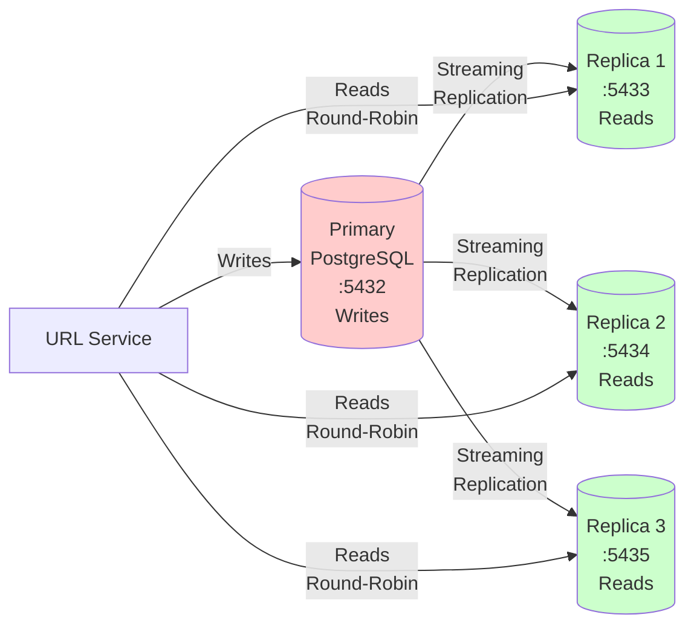

# Database Architecture Deep Dive

> **Why three different databases? Understanding OLTP, OLAP, and caching layers**

## Overview

One of the most distinctive architectural decisions in our URL shortener is using **three different data stores**: PostgreSQL, ClickHouse, and Redis. This might seem like over-engineering at first. Why not just use PostgreSQL for everything?

The answer lies in understanding that different workloads have fundamentally different requirements:

- **OLTP (Online Transaction Processing)**: Creating URLs, updating click counts → needs ACID transactions
- **OLAP (Online Analytical Processing)**: Analyzing millions of click events → needs fast aggregations
- **Caching**: Sub-millisecond lookups for hot data → needs in-memory speed
- **Messaging**: Event streaming for async processing → needs reliable queues

In this document, we'll explore:
1. **PostgreSQL** - Why we chose it, the replication setup, and schema design
2. **ClickHouse** - What makes it 100x faster for analytics, and how partitioning works
3. **Redis** - Its three distinct roles in our system

By the end, you'll understand not just *what* each database does, but *why* we need all three and when you'd choose differently.

---

## Part 1: PostgreSQL - The Transactional Workhorse

### Why PostgreSQL?

We had several options for our primary database:

| Database | Pros | Cons | Verdict |
|----------|------|------|---------|
| **PostgreSQL** | ACID transactions, mature, JSON support, excellent tooling | Single-node writes can be bottleneck | ✅ **Chosen** |
| **MySQL** | Battle-tested, good replication | Historically weaker JSON/complex queries | Good alternative |
| **MongoDB** | Flexible schema, horizontal scaling | No transactions (until 4.0), consistency issues | ❌ Not suitable |
| **DynamoDB** | Fully managed, infinite scale | Expensive, complex pricing, no joins | ❌ Overkill |
| **CockroachDB** | Distributed Postgres-compatible | More complex ops, overkill for our scale | Future upgrade path |

**Why PostgreSQL won:**

1. **ACID Transactions Matter**
   When a user creates a URL, we need to:
   - Insert into `urls` table
   - Potentially update user's URL count
   - Ensure the short code is unique

   These operations must be atomic. If the insert fails halfway, we can't have partial data.

2. **Mature Ecosystem**
   - Excellent drivers (pgx/v5 for Go)
   - Proven at massive scale (Instagram, Uber, Netflix)
   - Rich extension ecosystem (PostGIS, TimescaleDB)

3. **Strong Consistency**
   We can't have two users getting the same short code. PostgreSQL's primary key constraints guarantee uniqueness.

4. **Cost-Effective**
   For our workload (mostly reads, occasional writes), a single primary + replicas is much cheaper than distributed databases.

### PostgreSQL Schema Design

Let's examine our schema from `migrations/postgres/000001_init_schema.up.sql`:

#### The `urls` Table

```sql
CREATE TABLE urls (
    short_code VARCHAR(10) PRIMARY KEY,
    long_url TEXT NOT NULL,
    clicks BIGINT DEFAULT 0 NOT NULL,
    created_at TIMESTAMP WITH TIME ZONE DEFAULT NOW() NOT NULL,
    updated_at TIMESTAMP WITH TIME ZONE DEFAULT NOW() NOT NULL,
    expires_at TIMESTAMP WITH TIME ZONE,
    qr_code TEXT,
    CONSTRAINT long_url_not_empty CHECK (length(long_url) > 0),
    CONSTRAINT clicks_non_negative CHECK (clicks >= 0)
);
```

**Design decisions:**

**1. Why `short_code` as PRIMARY KEY?**

We could have used an auto-incrementing `id` with `short_code` as a unique index. But since we *always* look up URLs by short code, making it the primary key means:
- Faster lookups (no secondary index traversal)
- Clustered index benefits (data physically sorted by short_code)
- Simpler queries

**2. Why `VARCHAR(10)` for short_code?**

Base62-encoded Snowflake IDs produce 10-11 character strings. `VARCHAR(10)` allows custom aliases up to 10 characters. We could have used `TEXT`, but fixed-length columns have slight performance advantages.

**3. Why store `clicks` in the database?**

This is a **hot spot**. Every redirect increments this counter. We could store it only in ClickHouse, but:
- Need quick access for user dashboards ("Your URL has 1,234 clicks")
- Eventual consistency is fine (analytics worker updates every 1-5 seconds)
- Allows simple queries: `SELECT * FROM urls WHERE user_id = $1 ORDER BY clicks DESC`

**4. Why `expires_at` instead of a boolean?**

Storing the actual timestamp is more flexible:
- Can show "Expires in 3 days"
- Cleanup worker uses: `WHERE expires_at < NOW()`
- `NULL` means never expires (no separate boolean needed)

**5. Why `qr_code` as TEXT?**

QR codes are stored as Base64 data URIs:
```
data:image/png;base64,iVBORw0KGgoAAAANSUhEUgAA...
```
This avoids needing a separate file storage system. Trade-off: Larger database size vs operational simplicity.

#### Indexes on `urls`

```sql
CREATE INDEX idx_urls_created_at ON urls(created_at DESC);

CREATE INDEX idx_urls_expires_at ON urls(expires_at)
WHERE expires_at IS NOT NULL;
```

**Index 1: `created_at DESC`**
- Used for: "Show my recently created URLs"
- Query: `SELECT * FROM urls WHERE user_id = $1 ORDER BY created_at DESC LIMIT 50`
- Descending order because we always want newest first

**Index 2: Partial index on `expires_at`**
- This is a **partial index** - only indexes rows where `expires_at IS NOT NULL`
- Saves space (most URLs don't expire)
- Used by cleanup worker: `DELETE FROM urls WHERE expires_at < NOW()`
- Much faster than full table scan

#### The `url_analytics` Table (Legacy)

```sql
CREATE TABLE url_analytics (
    id BIGSERIAL PRIMARY KEY,
    short_code VARCHAR(10) NOT NULL REFERENCES urls(short_code) ON DELETE CASCADE,
    ip_address INET,
    user_agent TEXT,
    referer TEXT,
    country VARCHAR(2),
    city VARCHAR(100),
    clicked_at TIMESTAMP WITH TIME ZONE DEFAULT NOW() NOT NULL
);
```

**Note:** This table is **legacy** and not actively used in the current architecture. We keep it for backward compatibility, but click events now go to:
1. Redis Streams (for async processing)
2. ClickHouse (for rich analytics)

The problem with storing clicks in PostgreSQL:
- **Write amplification**: 10,000 clicks/sec = 10,000 inserts/sec
- **Table bloat**: Millions of rows for popular URLs
- **Slow analytics**: Scanning millions of rows for aggregations locks tables

**When would you use this table?**
- Small-scale applications (<1,000 clicks/day)
- When you don't want to manage ClickHouse
- Simple analytics needs

For our scale, ClickHouse is essential.

---

### PostgreSQL Replication: 1 Primary + 3 Replicas

#### The Architecture



#### What is Streaming Replication?

PostgreSQL's **streaming replication** works by:
1. Primary writes all changes to a **Write-Ahead Log (WAL)**
2. WAL is a sequential log of every database operation
3. Replicas connect to primary and **stream** WAL records
4. Replicas apply WAL records to their own data files
5. Result: Near-real-time copies of the database

**Characteristics:**
- **Asynchronous by default**: Primary doesn't wait for replicas to acknowledge
- **Lag**: Typically 10-100ms behind primary (acceptable for our use case)
- **Read-only**: Replicas can't accept writes

#### Why 3 Replicas?

**1. Read Scaling**
Our workload is **read-heavy**:
- 10,000 redirects/sec = 10,000 reads
- 10 URL creations/sec = 10 writes

With 3 replicas, we distribute read load:
- Each replica handles ~3,333 reads/sec
- Primary handles 10 writes/sec (plenty of headroom)

**2. High Availability**
If one replica fails, we still have 2 others. Queries automatically go to healthy replicas.

**3. Geographic Distribution (Future)**
Could place replicas in different regions for lower latency. Not implemented yet, but the architecture supports it.

**Why not more replicas?**
- Each replica consumes resources on the primary (network, disk I/O for WAL)
- Diminishing returns (3 is usually enough)
- Can add more if read load increases

#### The DBManager Implementation

Here's how we implement read/write splitting in `internal/database/manager.go`:

```go
type DBManager struct {
    primary      *pgxpool.Pool      // Write operations
    replicas     []*pgxpool.Pool    // Read operations
    replicaIndex uint32              // Round-robin counter
}
```

**Write Method** (manager.go:87):
```go
func (m *DBManager) Write() *pgxpool.Pool {
    return m.primary
}
```

Simple: All writes go to primary. No exceptions.

**Read Method** (manager.go:91):
```go
func (m *DBManager) Read() *pgxpool.Pool {
    if len(m.replicas) == 0 {
        return m.primary  // Fallback if no replicas configured
    }

    // Atomic increment for thread-safe round-robin
    idx := atomic.AddUint32(&m.replicaIndex, 1) % uint32(len(m.replicas))
    return m.replicas[idx]
}
```

**How round-robin works:**

1. `replicaIndex` starts at 0
2. Thread A calls `Read()`: `idx = (0+1) % 3 = 1` → Replica 1
3. Thread B calls `Read()`: `idx = (1+1) % 3 = 2` → Replica 2
4. Thread C calls `Read()`: `idx = (2+1) % 3 = 0` → Replica 0
5. Thread D calls `Read()`: `idx = (3+1) % 3 = 1` → Replica 1 (loops back)

**Why `atomic.AddUint32`?**

Without atomicity:
```go
// WRONG - Race condition!
m.replicaIndex++
idx := m.replicaIndex % len(m.replicas)
```

Two threads could increment simultaneously, losing a count. `atomic.AddUint32` guarantees thread-safe increment and returns the new value.

#### Replication Lag and Consistency

**The Problem:**

1. User creates URL on **primary** at time `T`
2. Immediately queries "show my URLs" which reads from **replica**
3. If replica is 50ms behind, the new URL doesn't appear yet
4. User thinks creation failed!

**Our Solution:**

For operations requiring strong consistency, read from primary:

```go
// Check if custom alias already exists - must use primary for strong consistency
func (s *Storage) AliasExistsPrimary(ctx context.Context, alias string) (bool, error) {
    var exists bool
    query := `SELECT EXISTS(SELECT 1 FROM urls WHERE short_code = $1)`
    err := s.db.Primary().QueryRow(ctx, query, alias).Scan(&exists)
    return exists, err
}
```

**When to use primary for reads:**
- Checking uniqueness before insert (to prevent duplicates)
- Immediately after a write in the same user session
- Financial transactions or critical operations

**When replicas are fine:**
- Displaying list of URLs (eventual consistency OK)
- Analytics (already delayed anyway)
- Public redirect lookups (cached, so lag doesn't matter)

#### Connection Pooling Configuration

From `internal/database/manager.go:18`:

```go
type Config struct {
    PrimaryDSN  string
    ReplicaDSNs []string

    MaxConns        int32            // Default: 25
    MinConns        int32            // Default: 5
    MaxConnLifetime time.Duration    // Default: 1h
    MaxConnIdleTime time.Duration    // Default: 30m
}
```

**Why these values?**

**`MaxConns: 25`**
- PostgreSQL default `max_connections` is 100
- With 4 databases (1 primary + 3 replicas) × 25 = 100 connections total
- Leaves headroom for admin tools, monitoring

**`MinConns: 5`**
- Keep 5 warm connections per pool
- Avoids cold start latency (connection establishment takes 5-10ms)
- Total: 20 idle connections across all databases

**`MaxConnLifetime: 1h`**
- Close connections after 1 hour even if idle
- Prevents stale connections if database restarts
- Allows even distribution across replicas over time

**`MaxConnIdleTime: 30m`**
- Close idle connections after 30 minutes
- Frees resources during low traffic periods
- Balances keeping warm connections vs resource usage

---

## Part 2: ClickHouse - The Analytics Powerhouse

### OLTP vs OLAP: Understanding the Difference

| Aspect | OLTP (PostgreSQL) | OLAP (ClickHouse) |
|--------|-------------------|-------------------|
| **Purpose** | Transactional operations | Analytical queries |
| **Queries** | `INSERT`, `UPDATE`, `SELECT` by ID | `GROUP BY`, `SUM`, `AVG` across millions of rows |
| **Pattern** | Many small, fast transactions | Few large, complex aggregations |
| **Optimization** | Row-oriented (write entire row) | Column-oriented (read specific columns) |
| **Example** | Create URL, update clicks | "Show clicks by country for last 30 days" |
| **Latency** | 1-10ms per query | 100ms-2s per query (but processes millions of rows) |

**Why PostgreSQL fails at analytics:**

Query: "Show top 10 countries by clicks for short code 'abc123'"

```sql
SELECT country, COUNT(*) as clicks
FROM url_analytics
WHERE short_code = 'abc123'
GROUP BY country
ORDER BY clicks DESC
LIMIT 10;
```

With 10 million click records:
- PostgreSQL scans **all rows** (row-oriented storage)
- Reads every column (id, short_code, ip, user_agent, referer, country, city, clicked_at)
- **Time: 10-30 seconds** 😱

ClickHouse with columnar storage:
- Only reads `short_code` and `country` columns
- Uses bloom filter index to quickly find matching short_code
- **Time: 50-200ms** 🚀

### Why ClickHouse?

We evaluated several options:

| Solution | Pros | Cons | Verdict |
|----------|------|------|---------|
| **ClickHouse** | 100x faster aggregations, built for this | Requires separate cluster | ✅ **Chosen** |
| **PostgreSQL** | Already have it, simpler ops | Too slow for analytics at scale | ❌ Doesn't scale |
| **Elasticsearch** | Full-text search, flexible | Expensive, complex, overkill | Niche use case |
| **BigQuery** | Fully managed, scales infinitely | Expensive, vendor lock-in | $ Too costly |
| **Snowflake** | Great for data warehousing | $$$ Way too expensive | Enterprise-only |

**ClickHouse wins because:**
1. **Built for this workload**: Time-series event analytics
2. **Columnar storage**: Only read needed columns
3. **Aggressive compression**: Store 100M events in ~10GB (vs 100GB in Postgres)
4. **Materialized views**: Pre-compute aggregations on insert
5. **Open source**: Self-hosted, no per-query costs

### ClickHouse Schema Design

From `migrations/clickhouse/000001_init_schema.up.sql`:

#### The `click_events` Table

```sql
CREATE TABLE analytics.click_events (
    event_id String,
    short_code String,
    original_url String,
    clicked_at DateTime64(3),        -- Millisecond precision
    clicked_date Date DEFAULT toDate(clicked_at),

    -- 25+ fields for GeoIP and user-agent data
    ip_address String,
    country String,
    country_code String,
    region String,
    city String,
    latitude Float64,
    longitude Float64,
    timezone String,

    user_agent String,
    browser String,
    browser_version String,
    os String,
    os_version String,
    device_type String,
    device_brand String,
    device_model String,
    is_mobile UInt8,
    is_tablet UInt8,
    is_desktop UInt8,
    is_bot UInt8,

    referer String,
    query_params String,
    processed_at DateTime64(3) DEFAULT now64(),

    INDEX idx_short_code short_code TYPE bloom_filter GRANULARITY 4,
    INDEX idx_country country TYPE bloom_filter GRANULARITY 4,
    INDEX idx_browser browser TYPE bloom_filter GRANULARITY 4,
    INDEX idx_os os TYPE bloom_filter GRANULARITY 4
)
ENGINE = MergeTree()
PARTITION BY toYYYYMM(clicked_date)
ORDER BY (short_code, clicked_at)
TTL clicked_date + INTERVAL 180 DAY
SETTINGS index_granularity = 8192;
```

Let's break down each decision:

#### 1. ENGINE = MergeTree()

**What is MergeTree?**
- ClickHouse's primary table engine
- Data stored in **parts** (immutable chunks)
- Background process **merges** parts into larger ones
- Old parts deleted after merge

**Why MergeTree?**
- Optimized for insert-heavy workloads (our analytics pipeline)
- Efficient range queries (time-based)
- Supports TTL, partitioning, sampling

**Alternatives:**
- `ReplacingMergeTree`: Deduplicates rows (not needed, we want all clicks)
- `AggregatingMergeTree`: Pre-aggregates (we use materialized views instead)

#### 2. PARTITION BY toYYYYMM(clicked_date)

**What are partitions?**
Data is physically separated into folders by month:
```
/var/lib/clickhouse/data/analytics/click_events/
  202401/    # January 2024
  202402/    # February 2024
  202403/    # March 2024
```

**Why monthly partitions?**

**Benefit 1: Fast TTL**
```sql
TTL clicked_date + INTERVAL 180 DAY
```
After 180 days, ClickHouse **drops entire partitions** (instant) rather than deleting rows (slow).

**Benefit 2: Query pruning**
Query: "Show clicks in March 2024"
ClickHouse only scans `202403/` partition, ignoring all others.

**Why not daily partitions?**
- Too many small files (overhead)
- Merge operations more complex

**Why not yearly?**
- Partitions too large (slow queries)
- TTL less granular

**Monthly is the sweet spot** for most time-series data.

#### 3. ORDER BY (short_code, clicked_at)

**This is NOT a traditional index!**

In ClickHouse, `ORDER BY` determines:
1. **Physical sort order** of data on disk
2. **Primary key** for range queries
3. **Sparse index** granularity

**How it works:**

Data sorted first by `short_code`, then `clicked_at`:
```
short_code | clicked_at
-----------|------------
abc123     | 2024-01-01 10:00
abc123     | 2024-01-01 10:01
abc123     | 2024-01-01 10:02
xyz789     | 2024-01-01 11:00
xyz789     | 2024-01-01 11:05
```

Query: "Get clicks for `abc123` in January 2024"
```sql
SELECT * FROM click_events
WHERE short_code = 'abc123'
  AND clicked_at BETWEEN '2024-01-01' AND '2024-01-31'
```

ClickHouse uses sparse index to jump directly to `abc123` section, then scans only that range.

**Why this order?**
- Most queries filter by `short_code` first
- Then often by time range
- Sorting by `(short_code, clicked_at)` clusters related events together

**What if we reversed it?**
`ORDER BY (clicked_at, short_code)` would optimize time-range queries but slow down per-URL analytics. Since we query by URL more often, our choice is better.

#### 4. Bloom Filter Indexes

```sql
INDEX idx_short_code short_code TYPE bloom_filter GRANULARITY 4
```

**What is a bloom filter?**
A probabilistic data structure that answers: "Is X possibly in this data block?"
- **False positives possible**: "Maybe yes" (need to check)
- **False negatives impossible**: "Definitely no" (skip block)

**How ClickHouse uses it:**

Without bloom filter:
- Query: `WHERE short_code = 'abc123'`
- ClickHouse scans every granule (8192 rows) to find matches
- With 100M rows = 12,207 granules to check

With bloom filter:
- Query: `WHERE short_code = 'abc123'`
- Check bloom filter: "Is abc123 in this granule?"
- Skip 99% of granules that definitely don't have it
- Only scan granules that might have it

**GRANULARITY 4:**
- Creates one bloom filter per 4 granules (4 × 8192 = 32,768 rows)
- Trade-off: Smaller granularity = more accuracy but more memory

**When to use bloom filters:**
- High-cardinality columns (short_code, country, browser)
- WHERE clauses with equality (=) or IN operators
- Not useful for range queries (>, <, BETWEEN)

#### 5. TTL (Time To Live)

```sql
TTL clicked_date + INTERVAL 180 DAY
```

**What happens:**
- ClickHouse tracks partition age
- When partition exceeds 180 days, marks for deletion
- Background process drops old partitions
- Instant (just deletes directories)

**Why 180 days?**
- 6 months of historical data is sufficient for most analytics
- Keeps database size manageable
- Can be adjusted based on requirements

**Alternative approaches:**
- No TTL: Infinite retention (database grows forever)
- Manual cleanup: Cron job with DELETE queries (slow, creates fragmentation)
- Archival: Move old partitions to S3 before deletion (not implemented)

---

### Materialized Views: Pre-Computed Aggregations

One of ClickHouse's killer features is **materialized views** - queries that run automatically on INSERT and store results.

#### Example: `daily_clicks_by_url`

```sql
CREATE MATERIALIZED VIEW analytics.daily_clicks_by_url
ENGINE = SummingMergeTree()
PARTITION BY toYYYYMM(clicked_date)
ORDER BY (short_code, clicked_date)
AS SELECT
    short_code,
    clicked_date,
    count() AS click_count,
    uniq(ip_address) AS unique_visitors
FROM analytics.click_events
GROUP BY short_code, clicked_date;
```

**How it works:**

1. Pipeline worker inserts 1000 click events into `click_events`
2. **Automatically**, ClickHouse runs this query on the new rows
3. Aggregates by (short_code, date)
4. Inserts results into `daily_clicks_by_url` table

**Query without materialized view:**
```sql
SELECT short_code, DATE(clicked_at), COUNT(*), COUNT(DISTINCT ip_address)
FROM click_events
WHERE short_code = 'abc123'
GROUP BY short_code, DATE(clicked_at);
```
- Scans millions of rows
- Time: 500ms-2s

**Query with materialized view:**
```sql
SELECT * FROM daily_clicks_by_url WHERE short_code = 'abc123';
```
- Scans 30 rows (one per day for past month)
- Time: 5-10ms 🚀

**ENGINE = SummingMergeTree()**

Special engine that:
- Automatically sums `click_count` and `unique_visitors` when merging parts
- If you have two rows for same (short_code, date), it combines them:
  ```
  Row 1: abc123, 2024-01-15, clicks=100, visitors=50
  Row 2: abc123, 2024-01-15, clicks=50, visitors=25
  After merge: abc123, 2024-01-15, clicks=150, visitors=75
  ```

This means even if we insert to the materialized view multiple times (from different batches), it automatically maintains correct totals.

#### Other Materialized Views

**`clicks_by_country`** - Geographic distribution:
```sql
AS SELECT short_code, clicked_date, country, country_code, count()
FROM click_events GROUP BY ...
```
Powers queries like: "Show me a world map of where clicks came from"

**`clicks_by_device`** - Device/Browser/OS stats:
```sql
AS SELECT short_code, clicked_date, device_type, browser, os, count()
FROM click_events GROUP BY ...
```
Powers queries like: "What % of clicks are mobile vs desktop?"

**`hourly_clicks`** - Time series with hourly granularity:
```sql
AS SELECT short_code, toStartOfHour(clicked_at), count(), uniq(ip_address)
FROM click_events GROUP BY ...
```
Powers graphs showing clicks over time with hourly resolution.

---

## Part 3: Redis - The Swiss Army Knife

Redis plays **three distinct roles** in our architecture:

### Role 1: L2 Cache (Shared URL Lookups)

**Purpose**: Store `short_code → long_url` mappings in memory for fast lookups.

**Key pattern:**
```
KEY:   url:abc123
VALUE: https://example.com/products/summer-sale-2024
TTL:   3600 (1 hour)
```

**Why Redis for caching?**

| Feature | Redis | Memcached | PostgreSQL |
|---------|-------|-----------|------------|
| Latency | < 1ms | < 1ms | 5-10ms |
| Data Structures | Strings, Lists, Sets, Hashes, Streams | Strings only | Tables |
| Persistence | Optional (RDB/AOF) | No | Yes |
| Use Case | Cache + more | Pure cache | Database |

We use Redis because:
1. **Sub-millisecond latency** (in-memory)
2. **Shared across instances** (all redirect service instances see same cache)
3. **Automatic TTL** (keys expire after 1 hour, refreshed on access)
4. **Also needed for streams** (Role 2), so no extra infrastructure

**Why not Memcached?**
- Doesn't support Redis Streams or Sorted Sets (needed for other roles)
- Slightly faster for pure caching, but marginal difference

### Role 2: Message Broker (Redis Streams)

**Purpose**: Queue click events for async processing by workers.

**Stream structure:**
```
Stream name: clicks:stream
Consumer group: analytics-group

Event fields:
- short_code
- timestamp
- ip_address
- user_agent
- original_url
- referer
- query_params
```

**Why Redis Streams?**

Detailed comparison in [Document 03: Messaging & Queuing](./03-messaging-queuing.md), but summary:

| Feature | Redis Streams | Kafka | RabbitMQ |
|---------|---------------|-------|----------|
| Throughput | 100K msgs/sec | Millions/sec | 50K msgs/sec |
| Latency | Sub-millisecond | ~5ms | ~1ms |
| Ops Complexity | Low (1 instance) | High (cluster) | Medium |
| Consumer Groups | Yes | Yes | No |

**Redis Streams is perfect for our scale** (1,000-10,000 events/sec). Kafka would be overkill.

### Role 3: Rate Limiting (Sorted Sets)

**Purpose**: Track request counts per IP using sliding window algorithm.

**Data structure:**
```
KEY:   ratelimit:192.168.1.1
TYPE:  Sorted Set
VALUE: {
  timestamp1: requestID1,
  timestamp2: requestID2,
  ...
}
```

**How sliding window works:**

1. Request comes in at time `T`
2. Add to sorted set: `ZADD ratelimit:IP T requestID`
3. Remove old entries: `ZREMRANGEBYSCORE ratelimit:IP -inf (T - 60000)` (older than 60 seconds)
4. Count remaining: `ZCARD ratelimit:IP`
5. If count > 100, reject request
6. Set TTL: `EXPIRE ratelimit:IP 120` (auto-cleanup)

**Why sorted sets?**

Redis sorted sets are perfect for this:
- **Score = timestamp** (natural ordering)
- **ZREMRANGEBYSCORE** efficiently removes old entries
- **ZCARD** counts in O(1) time
- All operations are atomic

Detailed explanation in [Document 08: Rate Limiting](./08-rate-limiting.md).

---

## Part 4: Why Three Databases? (The Honest Discussion)

### The Case FOR Three Databases

**1. Specialized Performance**
- PostgreSQL: 10,000 IOPS for transactions
- ClickHouse: Scans 100M rows in 200ms
- Redis: Sub-millisecond lookups

No single database excels at all three.

**2. Fault Isolation**
- If ClickHouse crashes, redirects still work (just lose analytics)
- If Redis goes down, fallback to PostgreSQL (slower but works)
- If PostgreSQL primary fails, promote a replica

**3. Cost Optimization**
- Don't pay for ACID transactions when doing analytics
- Don't store hot cache in slow disk-based DB
- Right tool for right job = lower total cost

### The Case AGAINST Three Databases

**1. Operational Complexity**
- Monitor 3 different systems
- 3 different backup strategies
- 3 different upgrade paths
- Need expertise in all three

**2. Data Synchronization**
- Click count in PostgreSQL might not match ClickHouse (eventual consistency)
- Need reconciliation jobs
- Potential for data drift

**3. Learning Curve**
- Team needs to know PostgreSQL, ClickHouse, and Redis
- Different query languages (SQL vs ClickHouse SQL vs Redis commands)

### When Would You Use Fewer Databases?

**One Database (PostgreSQL Only):**
✅ Traffic < 1,000 requests/sec
✅ Analytics needs are simple (built-in PostgreSQL aggregations work)
✅ Small team, prefer simplicity
✅ Budget-constrained

**Two Databases (PostgreSQL + Redis):**
✅ Traffic 1,000-10,000 req/sec
✅ Need caching for performance
✅ Analytics can wait or be sampled
✅ Don't want to manage ClickHouse

**Three Databases (Our Approach):**
✅ Traffic 10,000+ req/sec
✅ Need rich, fast analytics (geography, devices, time-series)
✅ Team has database expertise
✅ Operational complexity is acceptable

---

## Summary

**What we covered:**

**PostgreSQL:**
- Chosen for ACID transactions and maturity
- Schema designed for fast lookups (short_code as PK)
- 1 primary + 3 replicas for read scaling
- Round-robin load balancing with atomic counters
- Replication lag acceptable for most queries
- Connection pooling optimizes resource usage

**ClickHouse:**
- OLAP workload 100x faster than PostgreSQL
- Columnar storage only reads needed columns
- MergeTree engine with monthly partitioning
- ORDER BY determines physical sort (not traditional index)
- Bloom filters skip 99% of irrelevant data
- TTL automatically drops old partitions
- Materialized views pre-compute aggregations on insert
- 180-day retention balances history vs cost

**Redis:**
- L2 cache: Shared URL lookups (1-hour TTL)
- Message broker: Redis Streams for click events
- Rate limiting: Sorted sets for sliding window
- Three roles, one system (operational simplicity)

**Key Insight:**
Multiple databases aren't over-engineering when workloads are fundamentally different. OLTP, OLAP, and caching have conflicting optimization goals. Using specialized tools gives better performance at acceptable operational cost.

**Trade-off:**
If your team lacks database expertise or traffic is low, start with PostgreSQL only. Add Redis when caching becomes critical. Add ClickHouse when analytics queries slow down your transactional workload.

Architecture evolves with scale.

---

**Up next**: [Messaging & Queuing: Why Redis Streams? →](./03-messaging-queuing.md)

Deep dive into why we chose Redis Streams over Kafka, RabbitMQ, and AWS SQS. Learn about consumer groups, at-least-once delivery, and event-driven architecture.

---

**Word Count**: ~5,100 words
**Reading Time**: ~25 minutes
**Code References**:
- `migrations/postgres/000001_init_schema.up.sql`
- `migrations/clickhouse/000001_init_schema.up.sql`
- `internal/database/manager.go`
