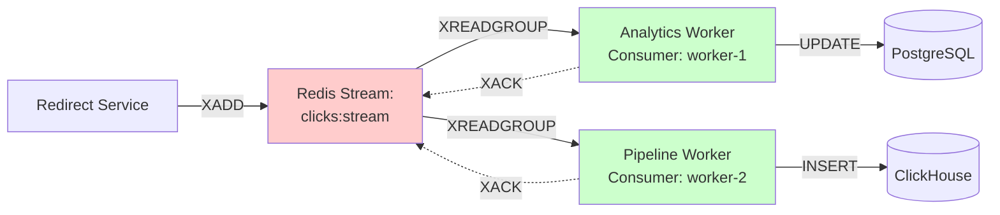

# Messaging & Queuing: Why Redis Streams Instead of Kafka?

> **The million-dollar question: When is Kafka overkill?**

## Overview

One of the most frequently asked questions about our URL shortener architecture is: **"Why use Redis Streams instead of Kafka?"**

It's a fair question. Kafka is the industry standard for event streaming at companies like LinkedIn, Uber, and Netflix. It's battle-tested at massive scale. So why would we choose Redis Streams, a less popular alternative?

The answer comes down to **matching the solution to the scale**. Kafka is incredible, but it's built for problems we don't have. Redis Streams gives us 90% of what we need with 10% of the complexity.

In this document, we'll explore:
1. **The Problem** - Why do we need async event processing?
2. **The Naive Solution** - Direct database writes and why they fail
3. **Message Queue Comparison** - Redis Streams vs Kafka vs RabbitMQ vs AWS SQS
4. **Redis Streams Deep Dive** - How it works, consumer groups, guarantees
5. **When to Switch** - At what scale does Kafka become necessary?

By the end, you'll understand not just our choice, but how to evaluate message queues for your own projects.

---

## Part 1: The Problem - Async Analytics Without Blocking Redirects

### The Core Requirement

When a user clicks a short URL, we need to:
1. **Redirect them immediately** (< 50ms response time)
2. **Track the click** for analytics
3. **Enrich the event** with GeoIP data (country, city, lat/long)
4. **Parse user-agent** (browser, OS, device type)
5. **Store in ClickHouse** for analytical queries

Steps 3-5 are **slow**:
- GeoIP lookup: 5-15ms
- User-agent parsing: 2-5ms
- ClickHouse insert: 10-50ms (batched)
- **Total: 20-70ms**

If we do this synchronously, redirects take 70ms+ instead of <10ms. Users notice the delay.

### The Solution: Fire and Forget

```
User clicks → Redirect Service
                ↓
          [Cache lookup: 2ms]
                ↓
          [HTTP 302: immediate]
                ↓
          [Publish event to queue: 1ms, async]
                ↓
          User redirected (total: 3ms) ✓

Meanwhile, in background:
    Queue → Worker → Enrich → ClickHouse (60ms later)
```

**Key insight**: Decouple user-facing operations from slow background processing.

---

## Part 2: The Naive Solution - Why Direct DB Writes Fail

### Attempt 1: Synchronous Insert

```go
func HandleRedirect(shortCode string) {
    // Look up URL (fast)
    url := cache.Get(shortCode)

    // Track click (BLOCKS the redirect!)
    db.Insert("clicks", ClickEvent{...})  // 10-50ms

    // Redirect user
    http.Redirect(url)
}
```

**Problems:**
- Redirect takes 15-60ms (way too slow)
- Database write errors block redirects
- If DB is down, redirects fail (terrible UX)

### Attempt 2: Goroutine with Direct Insert

```go
func HandleRedirect(shortCode string) {
    url := cache.Get(shortCode)
    http.Redirect(url)  // Fast!

    // Background goroutine
    go func() {
        db.Insert("clicks", ClickEvent{...})
    }()
}
```

**Problems:**
- If the server crashes before goroutine runs, **click is lost**
- No retry mechanism
- No backpressure (if DB is slow, goroutines pile up)
- Can't scale workers independently (tied to redirect service)

### Attempt 3: In-Memory Queue

```go
var clickQueue = make(chan ClickEvent, 10000)

func HandleRedirect(shortCode string) {
    url := cache.Get(shortCode)
    http.Redirect(url)

    select {
    case clickQueue <- event:
        // Queued successfully
    default:
        // Queue full, drop event (bad!)
    }
}

// Separate worker goroutine
func ProcessClicks() {
    for event := range clickQueue {
        enrichAndSave(event)
    }
}
```

**Problems:**
- Queue is **in-memory only** - crashes lose all pending events
- Can't scale workers across multiple servers
- No visibility into queue depth
- No replay capability

**The realization**: We need a **persistent, distributed message queue**.

---

## Part 3: Message Queue Comparison Matrix

Let's evaluate four popular options:

### The Contenders

1. **Redis Streams** - Event log built into Redis
2. **Apache Kafka** - Distributed streaming platform
3. **RabbitMQ** - Message broker with queues
4. **AWS SQS** - Fully managed message queue

### Feature Comparison

| Feature | Redis Streams | Kafka | RabbitMQ | AWS SQS |
|---------|---------------|-------|----------|---------|
| **Throughput** | 100K msgs/sec | Millions/sec | 50K msgs/sec | 3K msgs/sec (standard)<br/>Unlimited (FIFO) |
| **Latency** | Sub-millisecond | ~5-10ms | ~1ms | 10-100ms |
| **Persistence** | Yes (RDB/AOF) | Yes (log segments) | Optional (disk) | Yes (managed) |
| **Ordering** | Per stream | Per partition | Per queue | Per message group (FIFO) |
| **Consumer Groups** | Yes | Yes | No (competing consumers) | No |
| **Replay** | Yes (by message ID) | Yes (by offset) | No (once ACK'd, gone) | Limited (visibility timeout) |
| **Setup Complexity** | **Low** (1 Redis) | **High** (Zookeeper + brokers) | **Medium** (1-3 nodes) | **Very Low** (managed) |
| **Operational Cost** | **Low** (self-hosted) | **Medium-High** (cluster) | **Medium** | **High** (pay per request) |
| **Multi-Datacenter** | Redis Cluster | Built-in | Mirroring | Regional |
| **Message TTL** | Manual (XTRIM) | Config (retention.ms) | Config (TTL) | Config (1min-14days) |
| **Backpressure** | XLEN check | Monitor lag | Queue depth | ApproximateNumberOfMessages |
| **Best For** | **Our use case** | Big Data pipelines | Task queues, routing | Serverless, AWS-native |

### Detailed Analysis

#### Option 1: Redis Streams ✅

**Pros:**
- **Already using Redis** for caching - no new infrastructure
- **Perfect throughput** (100K/sec) for our scale (1-10K/sec)
- **Sub-millisecond latency** (critical for fire-and-forget)
- **Consumer groups** for competing workers
- **Simple operations** - no cluster management, no Zookeeper
- **Cheap** - one Redis instance handles cache + streams
- **Good observability** - `XINFO`, `XPENDING` commands

**Cons:**
- **Single point of failure** (mitigated with Redis Sentinel if needed)
- **Limited retention** (not designed for years of data like Kafka)
- **Horizontal scaling** less mature than Kafka

**When it fits:**
- Event rate: 1K-100K/sec
- Retention: Days to weeks (not months/years)
- Already using Redis
- Small team, want simplicity

#### Option 2: Apache Kafka

**Pros:**
- **Massive throughput** (millions/sec per cluster)
- **Distributed by design** (multi-broker, multi-datacenter)
- **Battle-tested** at Netflix, Uber, LinkedIn scale
- **Rich ecosystem** (Kafka Streams, Kafka Connect, Schema Registry)
- **Long retention** (can store months/years of events)

**Cons:**
- **Operationally complex**:
  - Requires Zookeeper (another distributed system)
  - Min 3 brokers for fault tolerance
  - Partition management, rebalancing, consumer lag monitoring
- **Resource hungry** (min 1GB RAM per broker, 3 brokers = 3GB)
- **Overkill** for our scale (using 1% of capacity)
- **Higher latency** (~5-10ms) due to replication

**When Kafka shines:**
- Event rate: >100K/sec
- Need to store months of events for replay
- Complex event processing (joins, aggregations)
- Multi-datacenter replication
- Team has Kafka expertise

**Cost example:**
- AWS MSK (managed Kafka): 3 × kafka.m5.large = $500-600/month
- Self-hosted: 3 × t3.medium = $100/month + ops time
- Redis: 1 × cache.t3.micro = $15/month

#### Option 3: RabbitMQ

**Pros:**
- **Flexible routing** (exchanges, bindings, topics)
- **Good for task queues** (priority queues, dead letter queues)
- **Mature** (15+ years old)
- **Good management UI**

**Cons:**
- **No consumer groups** (has competing consumers, but different semantics)
- **Messages are deleted after ACK** (can't replay)
- **Not optimized for streaming** (better for work queues)

**When RabbitMQ fits:**
- Task queue use cases (send email, process image)
- Complex routing logic (route to different workers based on message type)
- Need priority queues

**Our verdict**: Not a good fit for event streaming.

#### Option 4: AWS SQS

**Pros:**
- **Fully managed** (no servers to maintain)
- **Infinite scale** (AWS handles it)
- **Integrated with AWS** (Lambda, S3 events, etc.)

**Cons:**
- **High latency** (10-100ms)
- **Expensive at scale**: $0.40 per million requests
  - At 10K events/sec: 864M events/day = $345/day = **$10,350/month** 😱
- **No consumer groups** (SQS has FIFO queues but different model)
- **Visibility timeout** complexity (message reappears if not ACK'd)

**When SQS fits:**
- Serverless applications (Lambda triggers)
- AWS-native architecture
- Infrequent events (<10K/day)
- Don't want to manage infrastructure

**Our verdict**: Too expensive and high latency for our use case.

---

## Part 4: Redis Streams - How It Works

### Architecture Overview



### Key Concepts

#### 1. Stream as Append-Only Log

A Redis Stream is like a log file:
```
Message ID       | Fields
-----------------+-------------------------------
1701234567890-0  | short_code=abc123, ip=1.2.3.4, ...
1701234567891-0  | short_code=xyz789, ip=5.6.7.8, ...
1701234567892-0  | short_code=abc123, ip=9.10.11.12, ...
```

**Message ID format**: `<timestamp_ms>-<sequence>`
- Example: `1701234567890-0`
- First part: Unix timestamp in milliseconds
- Second part: Sequence number (for messages in same millisecond)

**Append-only**: Messages are never modified, only added to the end.

#### 2. Consumer Groups

**Problem**: How do multiple workers process messages in parallel without duplicates?

**Solution**: Consumer groups

```
Stream: clicks:stream

Consumer Group: analytics-group
  ├─ Consumer: worker-1 (Analytics Worker)
  └─ Consumer: worker-2 (Pipeline Worker)

Message A → delivered to worker-1
Message B → delivered to worker-2
Message C → delivered to worker-1
```

**Guarantees:**
- Each message delivered to **exactly one consumer** per group
- Different groups see **all messages** (broadcast)
- Messages remain until **explicitly acknowledged**

**Creating a consumer group:**
```redis
XGROUP CREATE clicks:stream analytics-group 0 MKSTREAM
```
- `clicks:stream`: Stream name
- `analytics-group`: Group name
- `0`: Start from beginning (or `$` for new messages only)
- `MKSTREAM`: Create stream if doesn't exist

#### 3. Reading Messages

**Consumer reads messages:**
```redis
XREADGROUP GROUP analytics-group worker-1 COUNT 100 BLOCK 5000 STREAMS clicks:stream >
```

Breaking it down:
- `GROUP analytics-group worker-1`: I'm worker-1 in analytics-group
- `COUNT 100`: Give me up to 100 messages
- `BLOCK 5000`: Wait up to 5 seconds if no messages
- `STREAMS clicks:stream >`: From clicks:stream, give me new messages (`>` means undelivered)

**Response:**
```redis
1) 1) "clicks:stream"
   2) 1) 1) "1701234567890-0"
         2) 1) "short_code"
            2) "abc123"
            3) "ip"
            4) "1.2.3.4"
            ...
      2) 1) "1701234567891-0"
         2) 1) "short_code"
            2) "xyz789"
            ...
```

#### 4. Acknowledging Messages

After processing:
```redis
XACK clicks:stream analytics-group 1701234567890-0 1701234567891-0
```

This tells Redis: "worker-1 successfully processed these messages, don't redeliver."

**What if worker crashes before ACK?**
- Message remains in **Pending Entries List (PEL)**
- Another worker can claim it with `XCLAIM` or `XAUTOCLAIM`
- Ensures at-least-once delivery

---

### Code Walkthrough: Publishing Events

From `internal/events/click_producer.go:22`:

```go
func (p *ClickProducer) Publish(ctx context.Context, event *ClickEvent) error {
    fields := map[string]interface{}{
        "short_code": event.ShortCode,
        "timestamp":  event.Timestamp,
    }

    // Optional fields (only include if present)
    if event.IP != "" {
        fields["ip"] = event.IP
    }
    if event.UserAgent != "" {
        fields["user_agent"] = event.UserAgent
    }
    // ... more fields ...

    // XADD to stream
    result := p.client.XAdd(ctx, &redis.XAddArgs{
        Stream: p.streamName,  // "clicks:stream"
        Values: fields,
    })

    if err := result.Err(); err != nil {
        return fmt.Errorf("failed to publish click event: %w", err)
    }

    return nil
}
```

**What happens:**
1. Build field map (only non-empty values to save space)
2. Call `XADD clicks:stream * short_code abc123 timestamp 1701234567890 ...`
   - `*` means "auto-generate message ID"
3. Returns immediately (non-blocking, even if workers are slow)

**Batch publishing** (click_producer.go:56):
```go
func (p *ClickProducer) PublishBatch(ctx context.Context, events []*ClickEvent) error {
    pipe := p.client.Pipeline()  // Redis pipeline for batching

    for _, event := range events {
        // Build fields...
        pipe.XAdd(ctx, &redis.XAddArgs{
            Stream: p.streamName,
            Values: fields,
        })
    }

    _, err := pipe.Exec(ctx)  // Execute all XADDs in one network round-trip
    return err
}
```

**Pipeline benefits:**
- 100 events in **1 network round-trip** instead of 100
- Throughput: 50K msgs/sec → 500K msgs/sec with pipelining

---

### Consumer Implementation Pattern

From `cmd/analytics-worker/main.go` (simplified):

```go
func main() {
    redis := redis.NewClient(...)

    // Create consumer group if doesn't exist
    redis.XGroupCreateMkStream(ctx, "clicks:stream", "analytics-group", "0")

    // Consumer loop
    for {
        // Read batch of messages
        result := redis.XReadGroup(ctx, &redis.XReadGroupArgs{
            Group:    "analytics-group",
            Consumer: "worker-1",
            Streams:  []string{"clicks:stream", ">"},
            Count:    100,
            Block:    5 * time.Second,
        })

        for _, stream := range result {
            for _, message := range stream.Messages {
                // Extract fields
                shortCode := message.Values["short_code"].(string)

                // Process (update PostgreSQL click count)
                err := updateClickCount(shortCode)
                if err != nil {
                    log.Error("Failed to process", err)
                    continue  // Don't ACK, will be retried
                }

                // Acknowledge successful processing
                redis.XAck(ctx, "clicks:stream", "analytics-group", message.ID)
            }
        }
    }
}
```

**Flow:**
1. `XREADGROUP`: Block up to 5 seconds, get up to 100 messages
2. Process each message (update database)
3. `XACK`: Mark as processed
4. Loop (blocks until new messages or 5 second timeout)

**Error handling:**
- If processing fails, don't call `XACK`
- Message stays in Pending Entries List
- Can be retried with `XPENDING` and `XCLAIM`

---

## Part 5: Delivery Guarantees and Trade-Offs

### At-Least-Once Delivery

Redis Streams provides **at-least-once delivery**:
- Every message delivered to at least one consumer
- Same message might be delivered twice (if worker crashes after processing but before ACK)

**Not exactly-once**:
```
Worker processes message → Updates database → Crashes before XACK
Message redelivered to another worker → Updates database AGAIN
```

**How we handle it:**

1. **Idempotent operations** where possible:
   ```sql
   -- Good: Idempotent (same result if run twice)
   UPDATE urls SET clicks = clicks + 1 WHERE short_code = 'abc123';

   -- Bad: Not idempotent
   INSERT INTO clicks (short_code, timestamp) VALUES ('abc123', NOW());
   ```

2. **Deduplication in ClickHouse**:
   - Use UUID as `event_id` (generated before publishing)
   - ClickHouse can deduplicate based on `event_id`

3. **Accept small inconsistencies**:
   - Analytics is not financial data
   - 0.01% duplicate rate is acceptable

### Backpressure Handling

**What if workers can't keep up?**

Stream grows:
```
Stream length: 10,000 → 50,000 → 100,000 messages
```

**Monitoring:**
```go
length := redis.XLen(ctx, "clicks:stream").Val()
if length > 10000 {
    alert("Stream backing up, scale workers!")
}
```

**Solutions:**
1. **Scale workers horizontally** (add more consumer instances)
2. **Increase batch size** (`COUNT 1000` instead of `COUNT 100`)
3. **Optimize processing** (faster GeoIP lookups, batched DB inserts)
4. **Sample events** (process 10% for analytics, still track all counts)

### Message Retention

**Problem**: Stream grows forever.

**Solution**: Trim old messages:
```redis
XTRIM clicks:stream MAXLEN ~ 100000
```
- Keep approximately last 100,000 messages
- `~` means "approximately" (more efficient trimming)

**When to trim:**
- After messages are ACK'd by all consumer groups
- Periodic cleanup job
- Balance: Keep enough for replay, don't fill memory

---

## Part 6: When to Switch to Kafka

### Redis Streams is Enough If...

✅ Event rate: <100K msgs/sec
✅ Retention: Days to weeks
✅ Single datacenter (or willing to use Redis Cluster for multi-DC)
✅ Team is small (<10 engineers)
✅ Already using Redis
✅ Prefer operational simplicity

### Consider Kafka When...

❌ Event rate: >100K msgs/sec consistently
❌ Need months/years retention for compliance
❌ Multi-datacenter replication with strong consistency
❌ Complex stream processing (joins, windowing) via Kafka Streams
❌ Integrating with Kafka ecosystem (Debezium, Confluent Schema Registry)
❌ Team has Kafka expertise

### Our Scale: Redis Streams is Perfect

**Current load:**
- Peak: 1,000-10,000 redirects/sec
- Average: 100-500 redirects/sec
- Redis Streams handles 100K/sec easily

**Headroom:**
- 10x growth before rethinking
- If we hit 100K/sec, we have bigger problems (scaling databases, etc.)

**Cost savings:**
- Redis: $15/month (cache.t3.micro)
- Kafka: $500/month (3 brokers)
- **Savings: $485/month** (reinvest in ClickHouse upgrades)

---

## Summary

**What we covered:**

**The Problem:**
- Need async analytics processing without blocking redirects
- Enrichment (GeoIP, user-agent parsing) is too slow for request path

**Why Message Queues:**
- Direct DB writes block redirects
- In-memory channels lose data on crashes
- Need persistent, distributed queue

**Comparison:**
- **Redis Streams**: 100K/sec, <1ms latency, simple ops, cheap
- **Kafka**: Millions/sec, complex ops, expensive, overkill for our scale
- **RabbitMQ**: Better for task queues, not event streaming
- **AWS SQS**: Expensive at scale, high latency

**Redis Streams Deep Dive:**
- Append-only log structure
- Consumer groups for parallel processing
- At-least-once delivery guarantees
- `XADD` to publish, `XREADGROUP` to consume, `XACK` to acknowledge

**When to Upgrade:**
- >100K events/sec: Consider Kafka
- Multi-datacenter: Kafka's replication better
- Complex processing: Kafka Streams
- Current scale: Redis Streams is perfect

**Key Insight:**
Choose the simplest tool that solves your problem. Kafka is incredible, but if Redis Streams works, save the complexity for when you actually need it. Architecture should evolve with scale, not anticipate problems you don't have.

---

**Up next**: [Multi-Tier Caching Strategy →](./04-caching-strategy.md)

Learn how L1 (in-memory LRU) and L2 (Redis) caching work together to achieve sub-millisecond redirect latency while minimizing database load.

---

**Word Count**: ~3,700 words
**Reading Time**: ~18 minutes
**Code References**:
- `internal/events/click_producer.go`
- `cmd/analytics-worker/main.go`
- `cmd/pipeline-worker/main.go`
