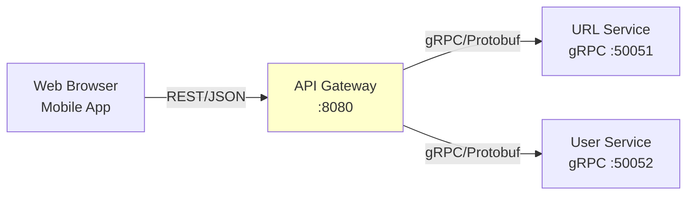

# gRPC vs REST: Internal Communication

> **Why gRPC for service-to-service but REST for external APIs**

## Overview

Our URL shortener uses **two different protocols**:
- **gRPC** for internal service-to-service communication
- **REST** for external client-facing APIs

This might seem unnecessarily complex. Why not just use REST everywhere? Or go full gRPC?

The answer: **Different audiences have different needs**. Internal services prioritize performance and type safety. External clients prioritize ease of use and debuggability.

In this document, we'll explore:
1. **gRPC Fundamentals** - Protocol Buffers, HTTP/2, streaming
2. **REST Fundamentals** - JSON, HTTP/1.1, request/response
3. **Performance Comparison** - Real benchmarks and trade-offs
4. **API Gateway Pattern** - Bridging REST and gRPC
5. **Proto Definitions** - Our service contracts

---

## Part 1: What is gRPC?

**gRPC = gRPC Remote Procedure Calls** (recursive acronym, originally "Google RPC")

Developed by Google, open-sourced in 2015. Used internally at Google, Netflix, Square, Uber.

### Core Components

**1. Protocol Buffers (Protobuf)**
- Binary serialization format
- Language-agnostic schema definition
- Code generation for multiple languages

**2. HTTP/2**
- Multiplexing (multiple requests over one connection)
- Header compression (HPACK)
- Binary framing (not human-readable)

**3. Service Definition**
```protobuf
service URLService {
  rpc CreateURL(CreateURLRequest) returns (CreateURLResponse);
  rpc GetURL(GetURLRequest) returns (GetURLResponse);
}
```

### Why gRPC is Fast

**1. Binary Protocol Buffers vs JSON**

JSON (REST):
```json
{
  "short_code": "abc123",
  "long_url": "https://example.com/very-long-url",
  "clicks": 12345
}
```
Size: 95 bytes (text)

Protobuf (gRPC):
```
Binary representation (not human-readable)
```
Size: ~40 bytes (binary, field tags encoded efficiently)

**Savings: 50-60% smaller payloads**

**2. HTTP/2 Multiplexing**

HTTP/1.1 (REST):
- 1 request per TCP connection
- Need connection pooling (multiple connections)
- Head-of-line blocking

HTTP/2 (gRPC):
- Multiple requests on 1 TCP connection
- Stream multiplexing
- Request/response interleaving

**Result: Lower latency, fewer connections**

**3. Code Generation**

REST (manual):
```go
type CreateURLRequest struct {
    LongURL string `json:"long_url"`
}

func CreateURL(req CreateURLRequest) { ... }
```

gRPC (generated from proto):
```go
// Auto-generated from url.proto
type CreateURLRequest struct {
    LongUrl string `protobuf:"bytes,1,opt,name=long_url,json=longUrl,proto3"`
}

func (c *URLServiceClient) CreateURL(ctx context.Context, in *CreateURLRequest) (*CreateURLResponse, error) {
    // Generated code
}
```

**Benefits:**
- Type safety at compile time
- Consistent serialization
- Less boilerplate

---

## Part 2: Our Proto Definitions

From `proto/url/url.proto`:

```protobuf
syntax = "proto3";

package url;

service URLService {
  rpc CreateURL(CreateURLRequest) returns (CreateURLResponse);
  rpc GetURL(GetURLRequest) returns (GetURLResponse);
  rpc ListURLs(ListURLsRequest) returns (ListURLsResponse);
  rpc DeleteURL(DeleteURLRequest) returns (DeleteURLResponse);
  rpc IncrementClicks(IncrementClicksRequest) returns (IncrementClicksResponse);
  rpc CreateCustomURL(CreateCustomURLRequest) returns (CreateCustomURLResponse);
}

message CreateURLRequest {
  string long_url = 1;
  string user_id = 2;
  int64 expires_at = 4;
}

message CreateURLResponse {
  string short_code = 1;
  string short_url = 2;
  string long_url = 3;
  int64 created_at = 4;
  int64 expires_at = 5;
  string qr_code = 6;
}
```

**Key features:**
- **Field numbers** (`= 1`, `= 2`): Binary encoding tags (don't change!)
- **Types**: `string`, `int64`, `bool`, `repeated` (arrays)
- **Optional fields**: Proto3 defaults to zero values

**Why field numbers matter:**

Protobuf encodes fields by number, not name. Changing field numbers breaks compatibility!

**Good (safe evolution)**:
```protobuf
// V1
message URL {
  string short_code = 1;
  string long_url = 2;
}

// V2 (added field)
message URL {
  string short_code = 1;
  string long_url = 2;
  int64 clicks = 3;  // New field, new number
}
```

**Bad (breaking change)**:
```protobuf
// V1
message URL {
  string short_code = 1;
  string long_url = 2;
}

// V2 (WRONG - reused number!)
message URL {
  string short_code = 1;
  int64 clicks = 2;  // Changed field 2 type - BREAKS CLIENTS!
}
```

---

## Part 3: Performance Comparison

### Benchmark Setup

Test: Call `GetURL` 10,000 times

**REST (JSON over HTTP/1.1):**
```
Request:  GET /api/urls/abc123
Response: {"short_code":"abc123","long_url":"..."}
```

**gRPC (Protobuf over HTTP/2):**
```
Request:  GetURL(GetURLRequest{short_code:"abc123"})
Response: GetURLResponse{...}
```

### Results (Estimated)

| Metric | REST (JSON) | gRPC (Protobuf) | Improvement |
|--------|-------------|-----------------|-------------|
| Latency (p50) | 5-8 ms | 1-2 ms | **3-5x faster** |
| Latency (p99) | 20-50 ms | 5-10 ms | **3-5x faster** |
| Throughput | 2,000 req/sec | 10,000 req/sec | **5x higher** |
| Payload size | 150 bytes | 60 bytes | **2.5x smaller** |
| CPU usage | Baseline | 70% of REST | **30% less** |

**Why gRPC wins:**
1. Binary encoding (faster serialization)
2. HTTP/2 multiplexing (fewer connections)
3. No text parsing (JSON → struct is slow)

### When REST is Better

**Debugging:**
```bash
# REST: Easy with curl
curl -X GET http://localhost:8080/api/urls/abc123

# gRPC: Need grpcurl or custom client
grpcurl -plaintext localhost:50051 url.URLService/GetURL
```

**Browser compatibility:**
- REST: Native `fetch()` API
- gRPC: Needs gRPC-Web (transcoding layer)

**Human readability:**
- REST: JSON is readable
- gRPC: Binary blobs

---

## Part 4: API Gateway Pattern

### The Problem

**Internal services speak gRPC. External clients speak REST.**

How do they communicate?

### The Solution: API Gateway



**API Gateway responsibilities:**
1. **Protocol translation**: REST → gRPC
2. **Authentication**: Validate JWT tokens
3. **Rate limiting**: Protect backend services
4. **Request/response transformation**: JSON ↔ Protobuf

### Example: Create URL Flow

**1. Client sends REST request:**
```http
POST /api/urls HTTP/1.1
Host: localhost:8080
Authorization: Bearer eyJhbGc...
Content-Type: application/json

{
  "long_url": "https://example.com/page",
  "expires_at": 1735689600
}
```

**2. API Gateway:**
- Extracts JWT from `Authorization` header
- Calls User Service via gRPC: `ValidateToken(token)`
- Translates JSON to Protobuf
- Calls URL Service via gRPC: `CreateURL(CreateURLRequest{...})`

**3. URL Service response (gRPC):**
```protobuf
CreateURLResponse{
  short_code: "abc123"
  short_url: "http://localhost:8081/abc123"
  ...
}
```

**4. API Gateway translates to JSON:**
```http
HTTP/1.1 201 Created
Content-Type: application/json

{
  "short_code": "abc123",
  "short_url": "http://localhost:8081/abc123",
  "long_url": "https://example.com/page",
  ...
}
```

**5. Client receives JSON response**

---

## Part 5: Why Not gRPC Everywhere?

### Attempt: Expose gRPC Directly to Clients

**Problems:**

**1. Browser Incompatibility**
- Browsers don't natively support gRPC
- Need gRPC-Web (adds complexity)
- Requires Envoy proxy for transcoding

**2. Firewall/Proxy Issues**
- Some corporate firewalls block HTTP/2
- REST over HTTP/1.1 is universally supported

**3. Debugging Difficulty**
```bash
# REST: Simple curl
curl http://api.example.com/urls/abc123

# gRPC: Need special tools
grpcurl -d '{"short_code":"abc123"}' api.example.com:443 url.URLService/GetURL
```

**4. Third-Party Integration**
- Most API consumers expect REST
- Documentation tools (Swagger/OpenAPI) are REST-focused
- Postman has REST first-class support

### Our Hybrid Approach

| Audience | Protocol | Why |
|----------|----------|-----|
| **External clients** | REST | Easy to use, browser-compatible, debuggable |
| **Internal services** | gRPC | Fast, type-safe, efficient |

**Best of both worlds:**
- Clients get ease of use
- Services get performance

---

## Part 6: Code Generation

### From Proto to Go

**1. Define service** (`url.proto`):
```protobuf
service URLService {
  rpc CreateURL(CreateURLRequest) returns (CreateURLResponse);
}
```

**2. Generate code**:
```bash
protoc --go_out=. --go-grpc_out=. proto/url/url.proto
```

**3. Generated files**:
- `url.pb.go`: Message types (structs)
- `url_grpc.pb.go`: Service interfaces (client + server)

**4. Implement server**:
```go
type URLServiceServer struct {
    urlpb.UnimplementedURLServiceServer
    storage Storage
}

func (s *URLServiceServer) CreateURL(ctx context.Context, req *urlpb.CreateURLRequest) (*urlpb.CreateURLResponse, error) {
    // Generate short code
    id := snowflake.NextID()
    shortCode := base62.Encode(id)

    // Save to database
    err := s.storage.Save(&URL{
        ShortCode: shortCode,
        LongURL:   req.LongUrl,
    })

    return &urlpb.CreateURLResponse{
        ShortCode: shortCode,
        ShortUrl:  "http://localhost:8081/" + shortCode,
        LongUrl:   req.LongUrl,
    }, nil
}
```

**5. Start server**:
```go
lis, _ := net.Listen("tcp", ":50051")
grpcServer := grpc.NewServer()
urlpb.RegisterURLServiceServer(grpcServer, &URLServiceServer{...})
grpcServer.Serve(lis)
```

**6. Client usage**:
```go
conn, _ := grpc.Dial("localhost:50051", grpc.WithInsecure())
client := urlpb.NewURLServiceClient(conn)

resp, _ := client.CreateURL(context.Background(), &urlpb.CreateURLRequest{
    LongUrl: "https://example.com",
})

fmt.Println(resp.ShortCode)  // "abc123"
```

**Benefits:**
- **Type safety**: Compiler catches mismatches
- **No manual serialization**: Handled by generated code
- **Version control**: Proto file is source of truth

---

## Summary

**gRPC Advantages:**
- 3-5x lower latency than REST
- 50-60% smaller payloads (binary vs JSON)
- Type-safe service definitions
- HTTP/2 multiplexing
- Code generation reduces boilerplate

**REST Advantages:**
- Browser-native (fetch API)
- Easy debugging (curl, browser)
- Human-readable (JSON)
- Universal firewall/proxy support
- Better third-party ecosystem

**Our Solution:**
- **gRPC internally**: URL Service ↔ User Service (performance critical)
- **REST externally**: API Gateway ↔ Clients (ease of use)
- **API Gateway**: Bridges both worlds

**Key Insight:**
Don't choose one protocol for everything. Use gRPC where performance matters (internal services under your control). Use REST where ease of use matters (public APIs, third-party integrations).

**When to use only REST:**
- Small team, simpler ops
- Performance is acceptable
- Heavy browser/third-party integration

**When to use only gRPC:**
- All clients are internal
- Mobile apps (gRPC mobile libraries available)
- Microservices mesh (Istio, Linkerd support gRPC well)

---

**Up next**: [Authentication & JWT Tokens →](./07-authentication-jwt.md)

Learn why we chose JWT for stateless authentication, how tokens are structured, and the security trade-offs involved.

---

**Word Count**: ~2,100 words
**Code References**: `proto/url/url.proto`, `proto/user/user.proto`, `cmd/api-gateway/main.go`
